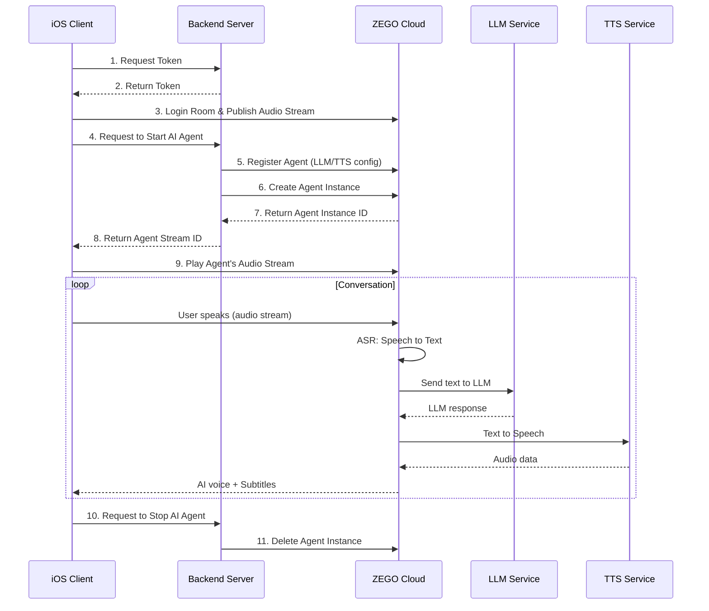

# How to Build a Conversational AI for iOS

*A comprehensive guide to implementing voice-based AI conversations in iOS apps with ZEGOCLOUD's SDK.*

## Introduction

Building **conversational AI for iOS** requires careful consideration of several interconnected systems: speech recognition, natural language processing, text-to-speech synthesis, and real-time audio streaming. Each component must work seamlessly together to create a natural conversational experience.

In this guide, I'll walk you through implementing a complete **voice conversational AI for iOS** using ZEGOCLOUD's Conversational AI SDK. We'll examine each architectural decision and explore why certain approaches work better than others in the iOS ecosystem. By the end, you'll have a production-ready implementation that handles **natural conversation with an AI** elegantly—with proper error handling, audio optimization, and real-time subtitle display.

Let's get started.

## Source Code Reference

The complete implementation is available for reference:

| Component | Repository |
|-----------|------------|
| **Backend Server + Web Client** | [github.com/ZEGOCLOUD/blog-aiagent-server-and-web](https://github.com/ZEGOCLOUD/blog-aiagent-server-and-web) |
| **iOS Client** | [github.com/ZEGOCLOUD/blog-aiagent-ios](https://github.com/ZEGOCLOUD/blog-aiagent-ios) |

## Prerequisites

Before beginning, ensure your development environment meets these requirements:

- **Xcode 15 or later** — We'll use SwiftUI and async/await extensively
- **ZEGOCLOUD Account** — [Register here](https://console.zegocloud.com/) to obtain your credentials
- **Swift proficiency** — Familiarity with modern Swift patterns (async/await, Combine) is helpful
- **Backend server** — We'll deploy a Next.js server to Vercel for handling authentication and agent lifecycle

## Understanding the Architecture

Before writing any code, it's essential to understand the system we're building. ZEGOCLOUD's Conversational AI employs a distributed architecture that separates concerns appropriately.

### The Client-Server Division

The architecture follows a deliberate security model. ZEGOCLOUD orchestrates three AI capabilities—**ASR** (Automatic Speech Recognition), **LLM** (Large Language Model), and **TTS** (Text-to-Speech)—in their cloud infrastructure. However, the sensitive credentials that authorize access to these services should never be exposed in client-side code.

This leads to a clear separation of responsibilities:

| Layer | Responsibility | Security Consideration |
|-------|---------------|------------------------|
| **Backend Server** | Token generation, agent lifecycle management, credential storage | Secrets remain server-side only |
| **iOS Client** | Audio capture, stream management, UI rendering, subtitle display | No sensitive credentials stored |
| **ZEGO Cloud** | ASR→LLM→TTS pipeline, real-time communication | Validates tokens, manages sessions |

### Data Flow Visualization



This sequence diagram illustrates the complete lifecycle of a conversation session. Note how the server acts as an intermediary for all privileged operations (steps 5-7), while the client handles only the real-time audio streaming directly with ZEGO Cloud.

## Step 1: Backend Server Implementation

The backend server is responsible for two critical functions: generating short-lived authentication tokens and managing the AI agent lifecycle. We'll implement this using Next.js API routes, which deploy seamlessly to Vercel.

### 1.1 Environment Configuration

Create a `.env.local` file with your credentials. Note the distinction between `NEXT_PUBLIC_` prefixed variables (exposed to the client) and others (server-only):

```bash
# ZEGO Configuration (from ZEGOCLOUD Console: https://console.zegocloud.com/)
NEXT_PUBLIC_ZEGO_APP_ID=your_app_id
ZEGO_SERVER_SECRET=your_server_secret_32_chars

# AI Agent Configuration
ZEGO_AGENT_ID=aiAgent1
ZEGO_AGENT_NAME=AI Assistant

# System Prompt - Define your AI's personality
SYSTEM_PROMPT="You are my best friend who I can talk to about anything."

# LLM Configuration (Large Language Model)
LLM_URL=https://your-llm-provider.com/api/chat/completions
LLM_API_KEY=your_llm_api_key
LLM_MODEL=your_model_name

# TTS Configuration (Text-to-Speech)
TTS_VENDOR=ByteDance
TTS_APP_ID=zego_test
TTS_TOKEN=zego_test
TTS_CLUSTER=volcano_tts
TTS_VOICE_TYPE=zh_female_wanwanxiaohe_moon_bigtts
```

### 1.2 Token Generation API

The token API generates authentication tokens for clients to connect to ZEGO's RTC service:

```typescript
// app/api/zego/token/route.ts
import { NextRequest, NextResponse } from 'next/server';
import crypto from 'crypto';

function generateToken(appId: number, userId: string, secret: string,
                       effectiveTimeInSeconds: number): string {
  // Token generation logic...
}

export async function POST(request: NextRequest) {
  const { userId } = await request.json();
  const token = generateToken(
    parseInt(process.env.NEXT_PUBLIC_ZEGO_APP_ID!),
    userId,
    process.env.ZEGO_SERVER_SECRET!,
    3600
  );
  return NextResponse.json({ code: 0, data: { token } });
}
```

### 1.3 Deploy to Vercel

Deploy your Next.js server to Vercel:

1. Push your code to GitHub
2. Go to [Vercel](https://vercel.com) and import your repository
3. Add all environment variables in Vercel's project settings
4. Click "Deploy"

Your server will be available at `https://your-project.vercel.app`.

## Step 2: Build the iOS Client

Now let's **build conversational AI for iOS** step by step.

### 2.1 Create iOS Project

Create a new iOS project in Xcode with:
- Interface: SwiftUI
- Language: Swift
- Minimum Deployment: iOS 14.0

### 2.2 Integrate ZEGO Express SDK

> ⚠️ **CRITICAL: You MUST use the AI Agent optimized SDK version (v3.22.0.46173)**
>
> The standard SDK from CocoaPods does NOT support the `onRecvExperimentalAPI` callback required for subtitle functionality. If you use the standard SDK, subtitles will NOT work!

**Download the AI Agent optimized SDK:**

1. Visit the [ZEGO SDK Download Page](https://www.zegocloud.com/docs/aiagent-server/introduction/download)
2. Download the iOS SDK (ZegoExpressVideo-ios-shared-objc.zip)
3. Extract and add `ZegoExpressEngine.xcframework` to your Xcode project

**Manual Integration Steps:**

1. Drag `ZegoExpressEngine.xcframework` into your Xcode project
2. In "Frameworks, Libraries, and Embedded Content", set it to "Embed & Sign"
3. Add required frameworks in Build Phases → Link Binary With Libraries:
   - `libc++.tbd`
   - `libresolv.tbd`
   - `AVFoundation.framework`
   - `AudioToolbox.framework`

### 2.3 Configure Info.plist

Add microphone permission and background audio mode:

```xml
<key>NSMicrophoneUsageDescription</key>
<string>This app needs access to your microphone for voice conversations with AI.</string>
<key>UIBackgroundModes</key>
<array>
    <string>audio</string>
</array>
```

### 2.4 App Configuration

Following Swift's best practices, we'll create a dedicated configuration struct. This pattern allows for easy environment switching and keeps magic values out of our implementation code:

```swift
// AppConfig.swift
struct AppConfig {
    // ZEGO App ID - Must match your backend configuration
    static let appID: UInt32 = 1234567890

    // Backend server URL (your Vercel deployment)
    static let serverURL = "https://your-project.vercel.app"

    static func generateUserId() -> String {
        return "user\(Int(Date().timeIntervalSince1970) % 100000)"
    }

    static func generateRoomId() -> String {
        return "room\(Int(Date().timeIntervalSince1970) % 100000)"
    }
}
```

### 2.5 API Service

Create a service to communicate with your backend server. This handles requesting tokens and managing the AI Agent lifecycle:

```swift
// ApiService.swift
class ApiService {
    static let shared = ApiService()

    struct TokenResponse: Codable {
        let code: Int?
        let data: TokenData?
    }

    struct TokenData: Codable {
        let token: String?
    }

    struct AgentResponse: Codable {
        let code: Int?
        let data: AgentData?
    }

    struct AgentData: Codable {
        let agentInstanceId: String?
        let agentStreamId: String?
    }

    /// Step 1-2: Request authentication token from backend
    func getToken(userId: String) async throws -> TokenResponse {
        let url = URL(string: "\(AppConfig.serverURL)/api/zego/token")!
        var request = URLRequest(url: url)
        request.httpMethod = "POST"
        request.setValue("application/json", forHTTPHeaderField: "Content-Type")
        request.httpBody = try JSONEncoder().encode(["userId": userId])

        let (data, _) = try await URLSession.shared.data(for: request)
        return try JSONDecoder().decode(TokenResponse.self, from: data)
    }

    /// Step 4, 5-8: Request backend to create AI Agent instance
    func startAgent(roomId: String, userId: String, userStreamId: String) async throws -> AgentResponse {
        let url = URL(string: "\(AppConfig.serverURL)/api/zego/start")!
        var request = URLRequest(url: url)
        request.httpMethod = "POST"
        request.setValue("application/json", forHTTPHeaderField: "Content-Type")

        // Server registers agent with ZEGO, creates instance, and returns stream ID
        let body = ["roomId": roomId, "userId": userId, "userStreamId": userStreamId]
        request.httpBody = try JSONEncoder().encode(body)

        let (data, _) = try await URLSession.shared.data(for: request)
        return try JSONDecoder().decode(AgentResponse.self, from: data)
    }

    /// Step 10-11: Request backend to stop AI Agent
    func stopAgent(roomId: String) async throws {
        let url = URL(string: "\(AppConfig.serverURL)/api/zego/stop")!
        var request = URLRequest(url: url)
        request.httpMethod = "POST"
        request.setValue("application/json", forHTTPHeaderField: "Content-Type")
        request.httpBody = try JSONEncoder().encode(["roomId": roomId])

        let _ = try await URLSession.shared.data(for: request)
    }
}
```

### 2.6 ZEGO Express Manager

The `ZegoExpressManager` encapsulates all RTC operations and serves as the single point of contact with the ZEGO SDK. Note the careful configuration of audio processing parameters—these settings are specifically tuned for conversational AI scenarios:

```swift
// ZegoExpressManager.swift
import ZegoExpressEngine

class ZegoExpressManager: NSObject {
    static let shared = ZegoExpressManager()

    var onRecvExperimentalAPI: ((String) -> Void)?

    func initEngine() {
        // Configure engine for AI conversation
        let engineConfig = ZegoEngineConfig()
        engineConfig.advancedConfig = [
            "set_audio_volume_ducking_mode": "1",
            "enable_rnd_volume_adaptive": "true"
        ]
        ZegoExpressEngine.setEngineConfig(engineConfig)

        // Create engine
        let profile = ZegoEngineProfile()
        profile.appID = AppConfig.appID
        profile.scenario = .highQualityChatroom
        ZegoExpressEngine.createEngine(with: profile, eventHandler: self)

        // Enable 3A audio processing
        let engine = ZegoExpressEngine.shared()
        engine.enableAGC(true)
        engine.enableAEC(true)
        engine.setAECMode(.aiBalanced)
        engine.enableANS(true)
        engine.setANSMode(.medium)
    }

    func loginRoom(roomId: String, userId: String, token: String,
                   callback: @escaping (Int32) -> Void) {
        let user = ZegoUser(userID: userId)
        let config = ZegoRoomConfig()
        config.token = token
        ZegoExpressEngine.shared().loginRoom(roomId, user: user, config: config) { errorCode, _ in
            callback(errorCode)
        }
    }

    func startPublishing(streamId: String) {
        ZegoExpressEngine.shared().startPublishingStream(streamId)
    }

    func startPlaying(streamId: String) {
        ZegoExpressEngine.shared().startPlayingStream(streamId)
    }
}

extension ZegoExpressManager: ZegoEventHandler {
    func onRecvExperimentalAPI(_ content: String) {
        // Forward raw content to subtitle message dispatcher
        onRecvExperimentalAPI?(content)
    }
}
```

### 2.7 Official Subtitle Component (Objective-C)

ZEGOCLOUD provides an official subtitle component written in Objective-C. You can download the complete subtitle component from the [ZEGO AI Agent iOS Documentation](https://doc-zh.zego.im/aiagent-ios/guides/display-subtitles.md).

The component consists of several files organized in a `Subtitles` folder:

```
Subtitles/
├── core/
│   ├── ZegoAIAgentSubtitlesDefines.h/m      # State enums and message classes
│   └── ZegoAIAgentSubtitlesColors.h/m       # Color configuration
├── protocol/
│   ├── ZegoAIAgentSubtitlesEventHandler.h   # Event handler protocol
│   ├── ZegoAIAgentSubtitlesMessageProtocol.h/m  # Message parsing
│   └── ZegoAIAgentSubtitlesMessageDispatcher.h/m # Message dispatcher singleton
├── views/
│   ├── ZegoAIAgentSubtitlesMessageModel.h/m     # Message model
│   ├── ZegoAIAgentSubtitlesCellLabelView.h/m    # Cell label view
│   └── ZegoAIAgentSubtitlesTableViewCell.h/m    # Table view cell
└── ZegoAIAgentSubtitlesTableView.h/m        # Main table view component
```

**Create a Bridging Header** to expose Objective-C classes to Swift:

```objc
// AIAgentDemo-Bridging-Header.h
#import "Subtitles/core/ZegoAIAgentSubtitlesDefines.h"
#import "Subtitles/core/ZegoAIAgentSubtitlesColors.h"
#import "Subtitles/protocol/ZegoAIAgentSubtitlesEventHandler.h"
#import "Subtitles/protocol/ZegoAIAgentSubtitlesMessageProtocol.h"
#import "Subtitles/protocol/ZegoAIAgentSubtitlesMessageDispatcher.h"
#import "Subtitles/views/ZegoAIAgentSubtitlesMessageModel.h"
#import "Subtitles/views/ZegoAIAgentSubtitlesCellLabelView.h"
#import "Subtitles/views/ZegoAIAgentSubtitlesTableViewCell.h"
#import "Subtitles/ZegoAIAgentSubtitlesTableView.h"
```

Configure the bridging header in Build Settings → Swift Compiler → Objective-C Bridging Header.

### 2.8 Chat ViewModel with Official Subtitle Component

The main ViewModel implements `ZegoAIAgentSubtitlesEventHandler` protocol to receive subtitle messages. It holds a `ZegoAIAgentSubtitlesTableView` instance for displaying subtitles:

```swift
// ChatViewModel.swift
@MainActor
class ChatViewModel: NSObject, ObservableObject, ZegoAIAgentSubtitlesEventHandler {
    @Published var isConnected = false
    @Published var statusText = "Disconnected"

    /// Official subtitle TableView component
    let subtitlesTableView: ZegoAIAgentSubtitlesTableView

    override init() {
        subtitlesTableView = ZegoAIAgentSubtitlesTableView(frame: .zero, style: .plain)
        super.init()
        setupZegoManager()
    }

    private func setupZegoManager() {
        ZegoExpressManager.shared.initEngine()

        // Register as subtitle event handler
        ZegoAIAgentSubtitlesMessageDispatcher.sharedInstance().register(self)

        // Forward experimental API content to subtitle dispatcher
        ZegoExpressManager.shared.onRecvExperimentalAPI = { content in
            ZegoAIAgentSubtitlesMessageDispatcher.sharedInstance().handleExpressExperimentalAPIContent(content)
        }
    }

    // MARK: - ZegoAIAgentSubtitlesEventHandler

    nonisolated func onRecvChatStateChange(_ state: ZegoAIAgentSessionState) {
        // Handle chat state changes
    }

    nonisolated func onRecvAsrChatMsg(_ message: ZegoAIAgentAudioSubtitlesMessage) {
        // ASR: User speech transcription (full replacement)
        DispatchQueue.main.async { [weak self] in
            self?.subtitlesTableView.handleRecvAsrMessage(message)
        }
    }

    nonisolated func onRecvLLMChatMsg(_ message: ZegoAIAgentAudioSubtitlesMessage) {
        // LLM: AI response (incremental accumulation)
        DispatchQueue.main.async { [weak self] in
            self?.subtitlesTableView.handleRecvLLMMessage(message)
        }
    }

    nonisolated func onExpressExperimentalAPIContent(_ content: String) {
        // Raw content callback for debugging
    }

    // Complete call flow orchestration
    func startCall() async {
        statusText = "Connecting..."

        do {
            // Generate unique IDs for this session
            let roomId = AppConfig.generateRoomId()
            let userId = AppConfig.generateUserId()
            let userStreamId = "\(roomId)_\(userId)_main"

            // Step 1-2: Request token from backend
            let tokenResponse = try await ApiService.shared.getToken(userId: userId)
            guard let token = tokenResponse.data?.token else {
                throw NSError(domain: "", code: -1, userInfo: [NSLocalizedDescriptionKey: "Failed to get token"])
            }

            // Step 3: Login to ZEGO room
            try await withCheckedThrowingContinuation { continuation in
                ZegoExpressManager.shared.loginRoom(roomId: roomId, userId: userId, token: token) { errorCode in
                    if errorCode == 0 {
                        continuation.resume()
                    } else {
                        continuation.resume(throwing: NSError(domain: "", code: Int(errorCode)))
                    }
                }
            } as Void

            // Step 3: Publish local audio stream (user's voice)
            ZegoExpressManager.shared.startPublishing(streamId: userStreamId)

            // Step 4-8: Request backend to create AI Agent
            let agentResponse = try await ApiService.shared.startAgent(
                roomId: roomId, userId: userId, userStreamId: userStreamId)
            guard let agentStreamId = agentResponse.data?.agentStreamId else {
                throw NSError(domain: "", code: -1, userInfo: [NSLocalizedDescriptionKey: "Failed to start agent"])
            }

            // Step 9: Play AI Agent's audio stream
            ZegoExpressManager.shared.startPlaying(streamId: agentStreamId)

            currentRoomId = roomId
            isConnected = true
            statusText = "Connected"
        } catch {
            statusText = "Error: \(error.localizedDescription)"
        }
    }

    // Step 10-11: End call and cleanup
    func endCall() async {
        if let roomId = currentRoomId {
            try? await ApiService.shared.stopAgent(roomId: roomId)
            ZegoExpressManager.shared.logoutRoom(roomId: roomId)
        }
        isConnected = false
        currentRoomId = nil
        statusText = "Disconnected"
    }

    private var currentRoomId: String?
}
```

This flow corresponds to steps 1-11 in the System Architecture diagram:

| Step | Action | Code |
|------|--------|------|
| 1-2 | Request Token | `ApiService.shared.getToken()` |
| 3 | Login Room & Publish Stream | `loginRoom()` + `startPublishing()` |
| 4-8 | Start AI Agent | `ApiService.shared.startAgent()` |
| 9 | Play Agent Stream | `startPlaying()` |
| 10-11 | Stop AI Agent | `ApiService.shared.stopAgent()` |

### 2.8 SwiftUI Views

Create the user interface:

```swift
// ContentView.swift
struct ContentView: View {
    @StateObject private var viewModel = ChatViewModel()

    var body: some View {
        HStack(spacing: 0) {
            // Left: Control Panel
            VStack(spacing: 24) {
                Text("ZEGO AI Agent")
                    .font(.title)

                HStack(spacing: 8) {
                    Circle()
                        .fill(viewModel.isConnected ? Color.green : Color.gray)
                        .frame(width: 12, height: 12)
                    Text(viewModel.statusText)
                }

                Button(action: {
                    Task {
                        if viewModel.isConnected {
                            await viewModel.endCall()
                        } else {
                            await viewModel.startCall()
                        }
                    }
                }) {
                    Text(viewModel.isConnected ? "End Call" : "Start AI Call")
                        .foregroundColor(.white)
                        .frame(width: 180, height: 50)
                        .background(viewModel.isConnected ? Color.red : Color.blue)
                        .cornerRadius(25)
                }
            }
            .frame(maxWidth: .infinity)

            // Right: Chat Messages - Using official subtitle component
            VStack(spacing: 0) {
                HStack {
                    Text("Conversation")
                        .font(.headline)
                    Spacer()
                }
                .padding(.horizontal)
                .padding(.vertical, 12)

                // Official ZegoAIAgentSubtitlesTableView wrapped for SwiftUI
                SubtitlesTableViewWrapper(tableView: viewModel.subtitlesTableView)
            }
            .frame(maxWidth: .infinity)
        }
    }
}

/// UIViewRepresentable wrapper for the official ZegoAIAgentSubtitlesTableView
struct SubtitlesTableViewWrapper: UIViewRepresentable {
    let tableView: ZegoAIAgentSubtitlesTableView

    func makeUIView(context: Context) -> ZegoAIAgentSubtitlesTableView {
        return tableView
    }

    func updateUIView(_ uiView: ZegoAIAgentSubtitlesTableView, context: Context) {
        // TableView updates automatically via handleRecvAsrMessage/handleRecvLLMMessage
    }
}
```

## Conclusion

## Summary

We've built a complete **conversational AI for iOS** that handles the full voice interaction loop: capturing audio, streaming to ZEGOCLOUD's infrastructure, receiving AI-generated responses, and displaying synchronized subtitles.

### Implementation Highlights

| Aspect | Implementation Detail |
|--------|----------------------|
| **SDK Integration** | Manual xcframework installation required for subtitle support |
| **Audio Pipeline** | AEC, AGC, ANS enabled with AI-balanced echo cancellation |
| **Subtitle Processing** | Official Objective-C `ZegoAIAgentSubtitlesTableView` component with `UIViewRepresentable` wrapper |
| **Security Model** | Server-side credential management with short-lived tokens |
| **Architecture** | MVVM pattern with async/await for clean async operations |

### Critical Considerations

1. **SDK Selection** — The standard CocoaPods distribution lacks the experimental API required for subtitles. The manually-downloaded SDK from ZEGOCLOUD's documentation is necessary.

2. **Audio Configuration** — Voice AI requires careful audio tuning. The AI-balanced AEC mode (`aiBalanced`) is specifically optimized for conversational AI scenarios where latency matters.

3. **Subtitle Message Semantics** — ASR messages (`Cmd=3`) contain the complete transcription at each update, while LLM messages (`Cmd=4`) contain only the new tokens. The official `ZegoAIAgentSubtitlesTableView` handles this distinction automatically.

4. **Swift/Objective-C Interop** — The official subtitle component is written in Objective-C. Use a bridging header to expose the classes to Swift, and wrap `ZegoAIAgentSubtitlesTableView` with `UIViewRepresentable` for SwiftUI integration.

4. **State Management** — The async nature of room login, agent creation, and stream playback requires careful sequencing. The `withCheckedThrowingContinuation` pattern bridges callback-based APIs with async/await.

### Potential Enhancements

For production applications, consider:

- **Conversation Persistence** — Store chat history in Core Data or a cloud backend
- **Offline Handling** — Graceful degradation when network is unavailable
- **Accessibility** — VoiceOver support and dynamic type for subtitles
- **Analytics** — Track conversation metrics for quality improvement

The ZEGOCLOUD SDK provides a solid foundation for building sophisticated voice AI experiences. The architecture we've implemented separates concerns appropriately and scales well as your application grows in complexity.

For detailed API documentation, refer to the [ZEGOCLOUD Developer Portal](https://www.zegocloud.com/docs).

